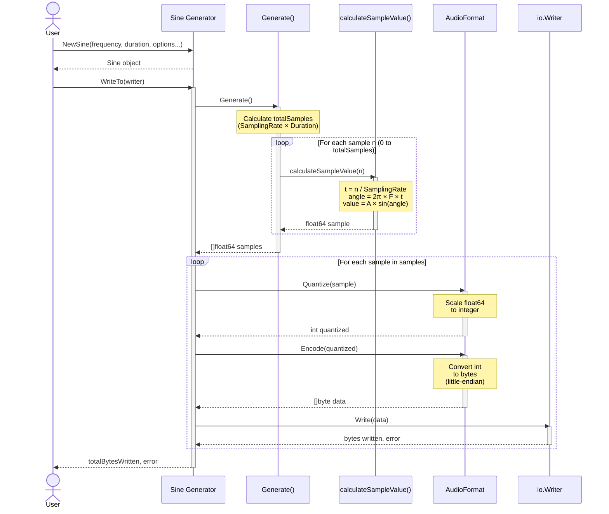

# lib.go.sound

[](https://github.com/ECecillo/lib.go.sound/actions/workflows/ci.yml)
[](https://github.com/ECecillo/lib.go.sound/actions/workflows/nightly.yml)
[](https://goreportcard.com/report/github.com/ECecillo/lib.go.sound)
[](https://opensource.org/licenses/Apache-2.0)

A Go library for generating and exporting sinusoidal signals with customizable parameters
such as frequency (`F`), amplitude (`A`), sampling rate (`f`), and duration(`d`).

# License & Attribution

This project is open-source and available under the MIT License. You are welcome to use it commercially or educationally.

Requirement: Please keep the LICENSE file and copyright notice in your project. Appreciated: While not required, a link back to this repository or a mention in your project's documentation is greatly appreciated!

## TODO

- [] Faire en sorte de pouvoir générer un signal avec une amplitude qui varie en fonction du temps.
  - Comment on peux configurer ça lors de la génération ?
    - Le problème de départ c'est que l'on utilise l'amplitude comme une constante et non une variable.
    On pourrait se dire que l'amplitude donné en config du signal est le max que cette dernière peut atteindre.
    Mais on aura quand même besoin de changer notre fonction de calcule de valeur d'echantillon pour avoir une
    amplitude variable.
    - Solution(s) :
      - Pour moi il faudrait pouvoir générer plusieurs fonctions `sinus` à la suite puis => Marche pas comme on sera
        calé sur les périodes on terminera jamais à la zeub sur un y différent d'un décalage.
        - Si on ajoute un décalage sur le départ de la fonction alors et que pour deux fonctions on a pas le même décalage
        alors on a besoin d'une fonction qui recolle les morceaux.
  - [] Modifier la fonction qui calcule la valeur de notre echantillon pour avoir une amplitude variable.

## Features

- Generate discrete sinusoidal signals with precise control over:
  - **Frequency** (in Hz)
  - **Amplitude**
  - **Sampling Rate** (in Hz)
  - **Duration** (as a `time.Duration`)
- Output signals in customizable audio formats using an `io.Writer`.
- Robust and scientifically validated against mathematical properties of sine waves.

## How It Works

The following sequence diagram illustrates the data flow when generating and exporting a sinusoidal signal:



The process consists of three main phases:

1. **Initialization**: Create a Sine generator with desired parameters (frequency, duration, amplitude, sampling rate, and format)
2. **Generation**: Calculate discrete samples using the sine formula: `A × sin(2π × F × t)`
3. **Conversion & Export**: Convert each float64 sample to the specified audio format and write to the output

## Verified Properties

The library has been tested extensively to ensure:

1. **Amplitude Conformance**: The generated signal always stays within the range `[−Amplitude, +Amplitude]`.
2. **Periodicity**: The signal repeats its values periodically at the specified frequency, within the constraints of discrete sampling.
3. **Reproducibility**: Generating the signal multiple times with identical parameters produces the same result.
4. **Theoretical Accuracy**: Signal values are validated against theoretical sine wave values at each sample point, with minimal error.
5. **Robustness to Extreme Parameters**:
   - Handles zero amplitude gracefully.
   - Supports very high frequencies and sampling rates.
   - Rejects invalid or nonsensical parameters.
6. **Output Functionality**: Supports writing generated data to any `io.Writer` for integration with audio pipelines or file outputs.

## Example Usage

```go
package main

import (
 "os"
 "time"

 "github.com/ECecillo/lib.go.sound/pkg/sine"
)

func main() {
 // Create a sine wave generator with 440 Hz frequency, 1-second duration, and 0.5 amplitude.
 sineWave := sine.NewSine(440.0, time.Second, sine.WithAmplitude(0.5), sine.WithSamplingRate(44100.0))

 // Write the generated signal to a file.
 file, err := os.Create("sine_wave.pcm")
 if err != nil {
  panic(err)
 }
 defer file.Close()

 _, err = sineWave.WriteTo(file)
 if err != nil {
  panic(err)
 }

 // Signal successfully written to sine_wave.pcm
}
```

## Installation

Install the library using `go get`:

```bash
go get github.com/ececillo/sine
```

## Getting Started (Local Development)

### Prerequisites

Install [Just](https://github.com/casey/just) - a modern command runner:

```bash
# macOS
brew install just

# Linux
cargo install just

# Windows
scoop install just
```

### Quick Start

The easiest way to use this library is through the included Just commands:

```bash
# Generate and play audio
just run      # Generate sine wave
just encode   # Convert to WAV format
just play     # Play the audio

# Or all at once
just all
```

### Available Commands

View all available commands:

```bash
just          # Lists all commands
just --list   # Same as above
```

## Running the Application

### Using Just (Recommended)

```bash
# Run the application
just run

# Generate audio → encode to WAV → play (all in one)
just all

# Or step by step
just run && just encode && just play

# Play with waveform visualization
just play-with-wave
```

### Using Go directly

```bash
# Run the application
go run cmd/main.go

# Encode the output
ffmpeg -f s16le -ar 44100 -ac 1 -i data/output.bin data/output.wav

# Play the result
ffplay data/output.wav
```

## Testing

This library includes comprehensive testing infrastructure to ensure quality and prevent regressions.

### Quick Test Check

Verify everything is working:

```bash
just test
```

### Test with Coverage

```bash
just test-coverage
```

**Current Coverage:**

- `pkg/format`: 100% ✓
- `pkg/sine`: 93.5% ✓

### Running Specific Tests

```bash
# Unit tests only
just test-unit

# Golden file tests (snapshot testing)
just test-golden

# Fuzz tests (edge case discovery)
just test-fuzz-quick      # 5 seconds each
just test-fuzz            # 30 seconds each

# Run everything
just test-all
```

### Pre-Commit Testing

Before committing changes, run the pre-commit check:

```bash
just pre-commit
```

This runs:

1. All unit tests
2. Coverage checks
3. Quick fuzz tests
4. Quick benchmarks

## Benchmarking

Track performance and detect regressions:

```bash
# Quick benchmark check
just bench-quick

# Run all benchmarks
just bench

# Save performance baseline
just bench-baseline

# Compare current performance with baseline
just bench-compare
```

**Performance Baseline:**

- Format conversion: 4 billion samples/sec
- Sine generation: 168 million samples/sec (3,800x real-time)
- Full pipeline: 64 million samples/sec (1,450x real-time)

## Development Workflow

### Making Changes

1. **Make your changes**

2. **Run tests**

   ```bash
   just test-coverage
   ```

3. **Check performance**

   ```bash
   just bench-compare
   ```

4. **Run pre-commit checks**

   ```bash
   just pre-commit
   ```

5. **Commit your changes**

### Updating Golden Files

If you intentionally changed audio output:

```bash
just test-golden-update
```

This will prompt for confirmation before updating reference files.

## Testing Infrastructure

This library uses four layers of testing:

1. **Unit Tests** - Test correctness and mathematical properties
2. **Golden File Tests** - Snapshot testing for byte-perfect output
3. **Fuzz Tests** - Automated edge case discovery
4. **Benchmark Tests** - Performance tracking and regression detection

### Documentation

- `TESTING.md` - Complete testing guide
- `BENCHMARKS.md` - Benchmark documentation
- `FUZZING.md` - Fuzzing guide
- `JUSTFILE_GUIDE.md` - Just command reference
- `TEST_SUMMARY.md` - Testing infrastructure overview

### Test Statistics

- **Total test functions**: 49+
- **Code coverage**: 93.5-100%
- **Golden files**: 9 reference files
- **Fuzz functions**: 9 automated tests
- **Benchmark functions**: 18 performance tests

## CI/CD

### Fast CI Pipeline (< 1 minute)

```bash
just ci-fast
```

### Comprehensive CI (~10 minutes)

```bash
just ci-comprehensive
```
