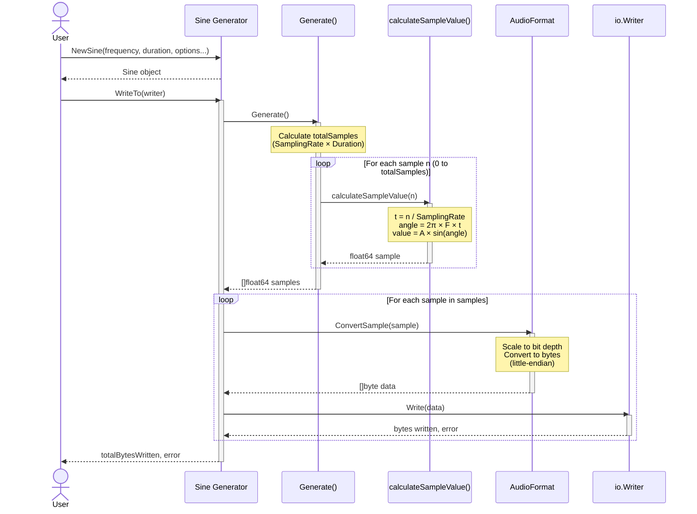

# lib.go.sound

A Go library for generating and exporting sinusoidal signals with customizable parameters
such as frequency (`F`), amplitude (`A`), sampling rate (`f`), and duration(`d`).

## TODO

- [] Faire en sorte de pouvoir générer un signal avec une amplitude qui varie en fonction du temps.
  - Comment on peux configurer ça lors de la génération ?
    - Le problème de départ c'est que l'on utilise l'amplitude comme une constante et non une variable.
    On pourrait se dire que l'amplitude donné en config du signal est le max que cette dernière peut atteindre.
    Mais on aura quand même besoin de changer notre fonction de calcule de valeur d'echantillon pour avoir une
    amplitude variable.
  - [] Modifier la fonction qui calcule la valeur de notre echantillon pour avoir une amplitude variable.

## Features

- Generate discrete sinusoidal signals with precise control over:
  - **Frequency** (in Hz)
  - **Amplitude**
  - **Sampling Rate** (in Hz)
  - **Duration** (as a `time.Duration`)
- Output signals in customizable audio formats using an `io.Writer`.
- Robust and scientifically validated against mathematical properties of sine waves.

## How It Works

The following sequence diagram illustrates the data flow when generating and exporting a sinusoidal signal:



The process consists of three main phases:

1. **Initialization**: Create a Sine generator with desired parameters (frequency, duration, amplitude, sampling rate, and format)
2. **Generation**: Calculate discrete samples using the sine formula: `A × sin(2π × F × t)`
3. **Conversion & Export**: Convert each float64 sample to the specified audio format and write to the output

## Verified Properties

The library has been tested extensively to ensure:

1. **Amplitude Conformance**: The generated signal always stays within the range `[−Amplitude, +Amplitude]`.
2. **Periodicity**: The signal repeats its values periodically at the specified frequency, within the constraints of discrete sampling.
3. **Reproducibility**: Generating the signal multiple times with identical parameters produces the same result.
4. **Theoretical Accuracy**: Signal values are validated against theoretical sine wave values at each sample point, with minimal error.
5. **Robustness to Extreme Parameters**:
   - Handles zero amplitude gracefully.
   - Supports very high frequencies and sampling rates.
   - Rejects invalid or nonsensical parameters.
6. **Output Functionality**: Supports writing generated data to any `io.Writer` for integration with audio pipelines or file outputs.

## Example Usage

```go
package main

import (
 "os"
 "time"

 "github.com/your-username/sine"
)

func main() {
 // Create a sine wave generator with 440 Hz frequency, 1-second duration, and 0.5 amplitude.
 sineWave := sine.NewSine(440.0, time.Second, sine.WithAmplitude(0.5), sine.WithSamplingRate(44100.0))

 // Write the generated signal to a file.
 file, err := os.Create("sine_wave.pcm")
 if err != nil {
  panic(err)
 }
 defer file.Close()

 _, err = sineWave.WriteTo(file)
 if err != nil {
  panic(err)
 }

 // Signal successfully written to sine_wave.pcm
}
```

## Installation

Install the library using `go get`:

```bash
go get github.com/ececillo/sine
```

## Running Tests

Run the tests to verify the functionality and properties of the library:

```bash
go test ./...
```

